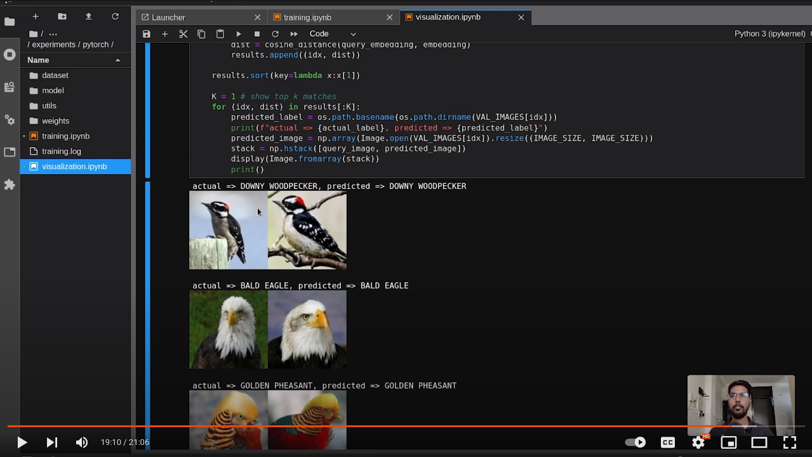
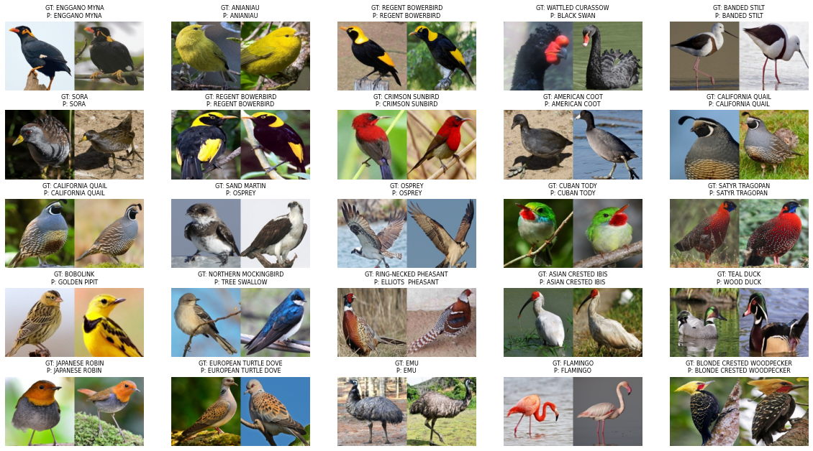

## Pytorch Triplet Loss (Metric Learning)

This repository is provides a hands on approach to train a Pytorch model using Metric Learning method. In short the model learns to differentiate between images of different classes, it returns a `N dimensional vector` which can be used to calculate distance between different embedding to find most similar image or label.

- Metric learning are specially useful when number of classes are very large and you may have less number of images per class.
- Please make sure that the number of images per class or the class distribution is balanced before training the model, You can apply augmentation method to over sample some classes which are less in number.

#### Companion YouTube Video

You can start by installing modules from `requirements.txt`

> Some module like Pytorch or torchvision is not included as you can use latest version

- To train the model, follow the [Training Notebook]([training.ipynb](https://github.com/imneonizer/pytorch-triplet-loss/blob/main/training.ipynb)
- While training, you can use the [Visualization Notebook](https://github.com/imneonizer/pytorch-triplet-loss/blob/main/training.ipynb) to see training graphs or test how model is performing by predicting on test images.

#### Prediction from trained model

